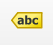
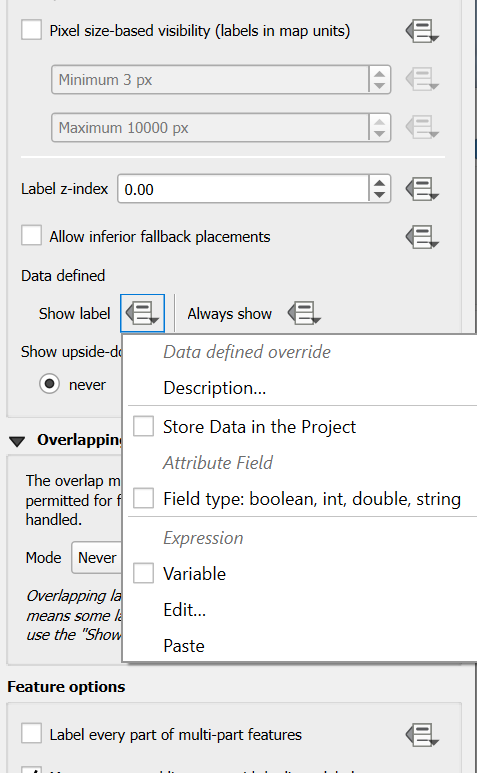
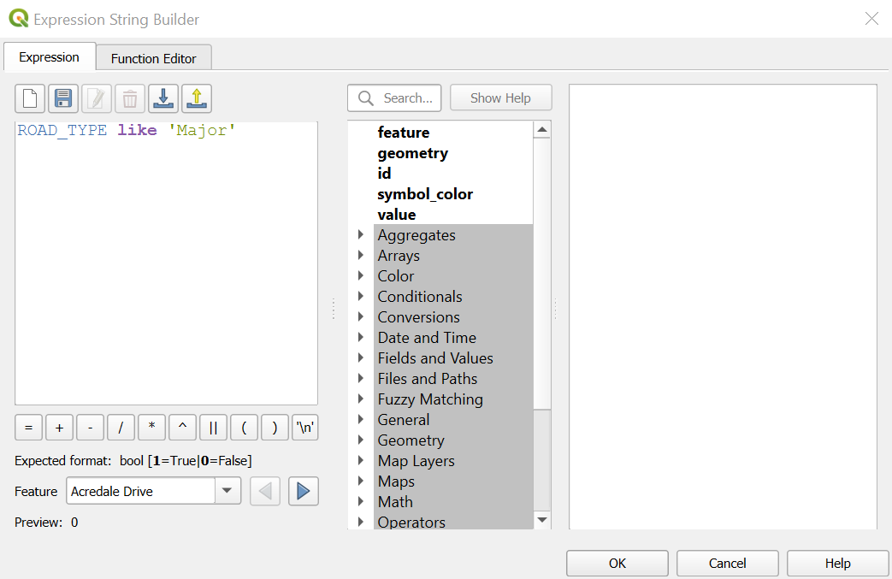
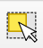
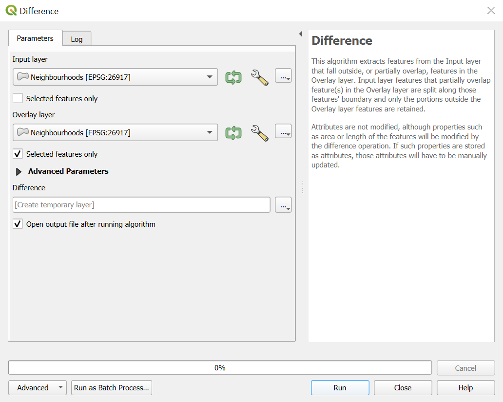
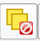

*Before starting this section, make sure you've completed all tasks in the [Preparation](preparation) page.*

# Lesson 1: Intro to GIS
In this first lesson, you will get a quick introduction to the QGIS interface. QGIS is the world's most popular open source GIS software. It is incredibly powerful and can do all sorts of interesting visualizations and analyses. The primary challenge with this much functionality is that you have to learn what the buttons do and understand the terminology. We'll work on that here. 

## Task 0: Download your data  
In this exercise, we'll learn how to use QGIS by using data that is available from the City of Hamilton [Open Data Portal](https://www.hamilton.ca/city-council/data-maps/open-data). The open data portal has a wide variety of numeric and geospatial data sets that are free and open to use. Many cities and regions now have similar kinds of open data portals, so be sure to check if you're ever doing analyses on your local area!

To download the data: 
- Download ```hamilton-data.zip``` from the [workshop GitHub repository](https://github.com/jasonbrodeur/SHAD-mapping/blob/main/data/hamilton-data.zip) by clicking [this link](https://github.com/jasonbrodeur/SHAD-mapping/raw/main/data/hamilton-data.zip) to download it directly [(bit.ly/shad-ham-data)](https://bit.ly/shad-ham-data).
- Download the data into the directory that you want to use for this workshop (i.e. know where you saved the file and use a folder where you can read/write data)
- **UNZIP THE FILE**. This is very important--otherwise, weird things are going to happen for you.   

## Task 1: Learn the interface; Add and explore data
**Objective**: Explore the user interface 
- Open QGIS. 
- Follow along with Jay and John as they introduce the important buttons and panels of the QGIS interface. 
- Go to ```Project>Properties``` and set your project Coordinate Reference System (CRS) to ```NAD83 / UTM zone 17N [EPSG:26917]```. 
	- Check the box to “Enable on-the-fly CRS transformation”
- Find your downloaded and unzipped data using the **Browser panel**.
- Add a number of vector layers from the downloaded City of Hamilton data by dragging the shapefile (.shp) into the data frame (large window). Be sure to include at least the ```Street_Centreline```, ```Buildings```, and ```Educational_Institutions``` layers. Add some more!
- Explore the attribute tables of these layers (Right-click on a layer in the **Layers panel** and select ```Open attribute table```.
- Save your project: >Project>Save As… [this saves a project file with an extension .qgs]. Give your project file a meaningful name.
	- Note that project files do not resave your layers--it simply preserves the links to the loaded layers, as well as any custom layer styling you’ve used.

## Task 2: Style vector layers 
**Objective**: Style your vector layers to create a map of a neighbourhood or area of Hamilton. 
- Add/remove layers from the Open Hamilton Data folder as necessary or desired. Keep ```Street_Centreline``` and ```Buildings```, and be sure to add all other relevant layers. 
- Move layers up and down in the **Layers panel**, note how it affects the drawing order.
- Style the layers by navigating to the **Style** tab of the Properties dialogue box (double click the layer or right-click and select ```Properties```).
- Follow Jay’s instructions on styling vector layers. Then, experiment on your own. 
- See [this YouTube video](https://goo.gl/MEyCrD) and some other videos by Klas Karlsson for ideas on custom vector styling.

## Task 3: Add labels to layers
- Select the ```Street_Centreline``` layer and click on the **Layer Labeling Options** button .
- In the top dropdown menu, select ```Single Labels```
- In the ```Value``` dropdown menu, select the ```STREET_NAM``` field. Click **Apply**.
- Explore the tabs for labelling options
	- In the **Text** tab, adjust the font type, size, colour (if desired).
	- If interested, experiment with the options in the **Formatting** tab.
	- In the **Buffer** tab, check to turn on ```Draw text buffer```.
	- In the **Rendering** tab, reduce the number of labels on the map by checking ```Merge connected lines to avoid duplicate labels```.
- Use a rule to more finely control which road labels are shown and display only roads that are designated as 'Major' in the ROAD_TYPE column in the attribute table: 
	- In the **Rendering** tab, go to the ```Data defined``` section and select the dropdown beside ```Show label```. In the dropdown, select ```Edit```
	- 
  	- In the ```Expression``` box of the **Expression String Builder** window, enter: ```ROAD_TYPE like 'Major'```. Click OK.
	- 
  	- Note that the labels are now only applied to major roads. 
	- Keep this setting, or remove it by re-clicking the dropdown and selecting ```Clear```.

## Task 4: Identify a Hamilton neighbourhood to map
**Objective**: Here, you are going to select a neighbourhood of your choice and prepare it for exporting a map. 
**Note**: If you get behind on the lesson or something goes wrong here, simply skip to Task 5 to catch up. 
- Add all layers of interest. Ensure that you have added the ```Neighbourhoods``` layer to your map and that it is the topmost layer (drag or move it up).
- Turn on labels for the ```Neighbourhoods``` layer and label it using the value of the "NEIGHBOURH" field.
- Style the ```Neighbourhoods``` layer so that the areas are not filled (outline only). Use a thick border so that you can distinguish their boundaries.
- Zoom to the approximate extent of your neighbourhood.
- Select the other layers you would like to show and style them appropriately.
- Select the polygon that represents your neighbourhood's extent in the ```Neighbourhoods``` layer.
  - Select the ```Neighbourhoods``` layer in the **Layers** panel and ensure it is highlighted.
  - From the top toolbar, click on the ```Select Features by Area of Single Click``` button .
  - In the map pane, click within the boundaries of your neighbourhood. If you've done this correctly, your neighbourhood should highlight in yellow.
- Use the ```Difference``` tool to show your neighbourhood and black out the rest
  - With your neighbourhood selected in the map pane go to ```Vector > Geoprocessing Tools > Difference``` in the top menu.
  - When the ```Difference``` window appears, enter the following values:
    - ```Input layer```: ```Neighbourhoods``` (Leave ```Selected features only``` unchecked) 
    - ```Overlay layer```: ```Neighbourhoods``` (Check ```Selected features only```)
    - 
    - Click Run. If done correctly, you should have a new layer called ```Difference``` at the top of your Layers list. The ```Difference``` layer should show all areas except your neighbourhood in a solid colour.
    - Deselect your neighbourhood by clicking the ```Deselect Features from all Layers``` button  from the top toolbar.
    - Finally, choose a very dark colour (black, dark grey, dark blue, dark purple, etc.) or very light colour (e.g., white) for your ```Difference``` layer and change opacity to between 50 and 80%. This will wash out the surrounding neighbourhoods and help yours stand out.

## Task 5: Compose a map of your selected neighbourhood
**Objective**: Create a map of your chosen Hamilton Neighbourhood.
- Zoom the main data frame to the approximate desired extents for your map.
- Click on the **New Print Layout** button to open the map creation window. 
	- Give your map a name when the dialogue box comes up. 
- In the map composer, add the critical elements of a map: 
	- Click the **Add new map** button and then draw a box to specify your map’s extent on the page. This will draw the contents of your data frame onto the map. 
	- Use the **Move Item Content* button to change the extent and zoom. Click “Update Preview” in the “Main Properties” box to regenerate preview.
- With the map content selected, go to **Item Properties** and add a frame (if desired), a grid, or both.
- See [this video](http://goo.gl/3yPkme) for some examples of how to style the map.  

## Task 6: Annotate the map 
- Use the **Add New Labels** button to add any desired labels (Use the ```Item Properties``` tab to control font size, colour, and background)
- Use the **Add North Arrow** button to add a North arrow
	- With the north arrow selected, scale it to the right size
	- Go to ``` > Item Properties``` to select symbol different than the default. 
- Use the **Add Label** button to add a title. Include the creator's name and creation date
- Use the “Add legend” button to insert a legend, if desired. 
	- With the legend selected, click the “Item Properties” tab, rename and rearrange the legend items
- Use the **Add Scale Bar**  tool to insert a scale bar 
	- Drag the bar to the desired location and size. Edit other details in the **Items Properties** box, if desired.
	- Set units to Meters, and Label to “m” (if not already done for your map) 
	- Select the desired number of segments,

## Task 7: Export the map to an image file
- In the map composer, use either the **Export as image** or **Export as PDF** buttons to export the map in the desired format to a desired directory. 

## Task 8: Save your project file 
- Click the **Save** button to save your changes. 

**All done?** Let's move on to your [second lesson](mapping-our-data), where we will map our newly-collected data!
