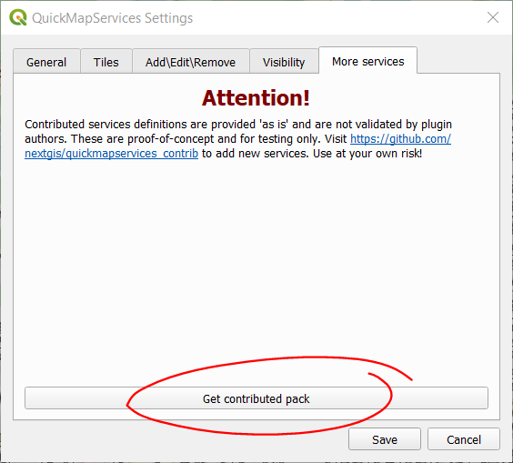
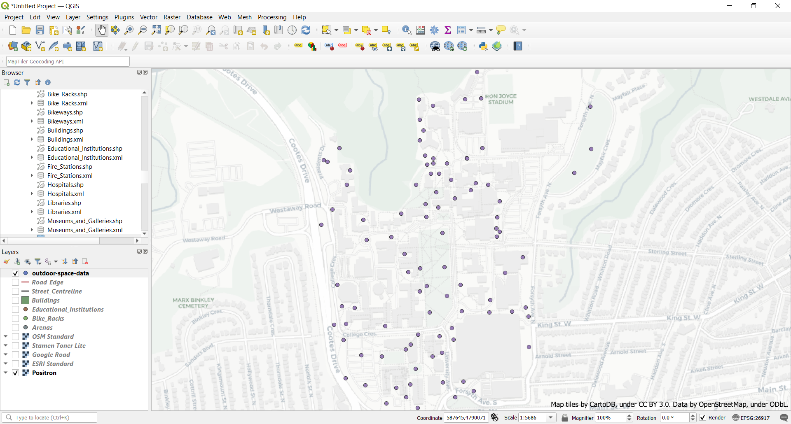

**FIND THIS WEBSITE AT [bit.ly/shad-mapping-exercise](https://bit.ly/shad-mapping-exercise)**

*Before starting this section, make sure you've completed all tasks in the [Preparation](preparation) page and completed [Lesson 1: Intro to GIS](intro-to-GIS).*

# Lesson 2: Mapping our data 
In this lesson, you will build on the skills gained during [lesson 1], to create a map that shows the outcome of our outdoor spaces assessment. 

## Task 0: Download our data set
- Download our ```outdoor-space-data.csv``` file (as a zip file) using [this link](https://minhaskamal.github.io/DownGit/#/home?url=https://github.com/jasonbrodeur/SHAD-2023/blob/main/data/outdoor-space-data.csv) (or at [bit.ly/shad-2023-our-data](https://bit.ly/shad-2023-our-data)). This file is hosted on our [workshop GitHub repository](https://github.com/jasonbrodeur/SHAD-2023/blob/main/data/).
- Download the data into the same working directory as the first exercise. 
- **UNZIP THE FILE**. This is very important--otherwise, weird things are going to happen for you.   

## Task 1: Open a new project, add a plugin and a web base map
- Open a new project. Set the project CRS to ```EPSG 3857: WGS84 - Pseudo Mercator projection```
- In this next step, we want to add a web map as a base map upon which to show our data. To do this, we need to install a plugin from the built-in plugin manager
	- As an open-source project QGIS has a lot of community-contributed Plugins that extend its functionality. Over time, many of these plugins find their way into the core software.
- Install the QuickMapServices plugin:
	- In the top menu bar, click on ```Plugins > Manage and Install Plugins```.
	- In the Plugins dialogue box, search for and install the **QuickMapServices** plugin. 
	- 
	- To allow us to add additional web layers, on the top menu, click ```Web > QuickMapServices > Settings```. Go to the **More Services** tab and click **Get contributed pack**. Close the window.
	- 
	- While the Plugin window is open, also install the **qgis2web** plugin.
	- Once the plugins are installed, close the plugins window.
- Add a web base map to your data frame: 
	- In the top menu bar, click on ```Web > QuickMapServices```.
	- Explore and add a base map of your liking. 
Choose a web map for your base map (e.g. check out the OSM, Stamen, and CartoDB maps)
	- Be sure to right-click and ```Remove Layer``` for any layer you don't want to use. 

## Task 2: Add our data file, turn it into a spatial layer 
- In the top menu, click on ```Layer > Add Layer > Add Delimited Text Layer...```.
- Browse to the ```outdoor-space-data.csv``` file, select and Open it.
- Enter the following information: 
	- **File Format**: CSV
	- **Geometry Definition**: ```X field``` : ```Longitude``` ; ```Y field``` : ```Latitude```.
	- **Geometry CRS**: EPSG:4326 - WGS 84
- Click **Add**. When prompted about a transformation, just click OK. 
- Our survey points should now show on the map in the expected locations (i.e. McMaster University).


## Task 3: Stylize symbols to communicate the suitability score and size of the plot
- Ensure that the ```outdoor-space-data``` layer is above your web map in the **Layer panel**.
- Right click the ```outdoor-space-data``` layer and select ```Properties```. Click on the ```Symbology``` tab
- In the top dropdown menu, change to ```Graduated```
- In the **Value** dropdown, select a measure of interest (i.e. Suitability Score)
- In the **Symbol** area, click the current symbol to change it. 
	- In the symbol dialogue box, click the more options icon beside the **Size** setting. 
	- Select ```Edit```. In the Expression box, enter ```"Num Seats" /40``` -- this will scale the size of the marker to the number of seats that are available at the location. 
	- Click OK
- Select a Color ramp from the dropdown menu. Be thoughtful with your colour selection: think about what kind of message/sentiment do your selected colours convey. Is it aligned with what you're communicating in your map? 
- Click ```Classify``` and observe that 5 classes are created. Click **Apply** to see the changes on the map.
- Click OK on the Properties box.
- In the ```Layer Rednering``` box, edit the transparency of this layer so that the webmap beneath shows a bit.
- Click OK to exit the layer properties dialog box.

## Task 4: Add other layers (if desired)
- If you would like to augment your map with other data, add Hamilton Open Data layers and style them appropriately. 

## Task 5: Compose your map
- Zoom the main data frame to the approximate desired extents for your map.
- Click on the **New Print Layout** button to open the map creation window. 
	- Give your map a name when the dialog box comes up. 
- In the map composer, add the critical elements of a map: 
	- Click the **Add new map** button and then draw a box to specify your map’s extent on the page. This will draw the contents of your data frame onto the map. 
	- Use the **Move Item Content* button to change the extent and zoom. Click “Update Preview” in the “Main Properties” box to regenerate preview.
- WIth the map content selected, go to **Item Properties** and add a frame (if desired), a grid, or both.
- See [this video](http://goo.gl/3yPkme) for some examples of how to style the map.  

## Task 6: Annotate the map 
- Use **Add New Labels** button to add any desired labels (Use “Item Properties” tab to control font size, colour, background)
- Use the **Add North Arrow** button to add a North arrow
	- With the north arrow selected, scale it to the right size
	- Go to ``` > Item Properties``` to select symbol different than the default. 
- Use the **Add Label** button to add a title. Include the creator name and creation date
- Use the “Add legend” button to insert a legend, if desired. 
	- With the legend selected, click the “Item Properties” tab, rename and rearrange the legend items
- Use the **Add Scale Bar**  tool to insert a scale bar 
	- Drag the bar to the desired location and size. Edit other details in the **Items Properties** box, if desired.
	- Set units to Meters, and Label to “m” (if not already done for your) 
	- Select desired number of segments,

## Task 7: Export the map to an image file
- In the map composer, use either the **Export as image** or **Export as PDF** buttons to export the map in the desired format to a desired directory. 

## Task 8: Save your project 
- Save your project and close the map composer window. Keep your project open in the main QGIS interface.  

**Are you ready for your final challenge?** Head to the [next lesson](publish-webmap) to learn how to create and publish a webmap using QGIS and GitHub!
