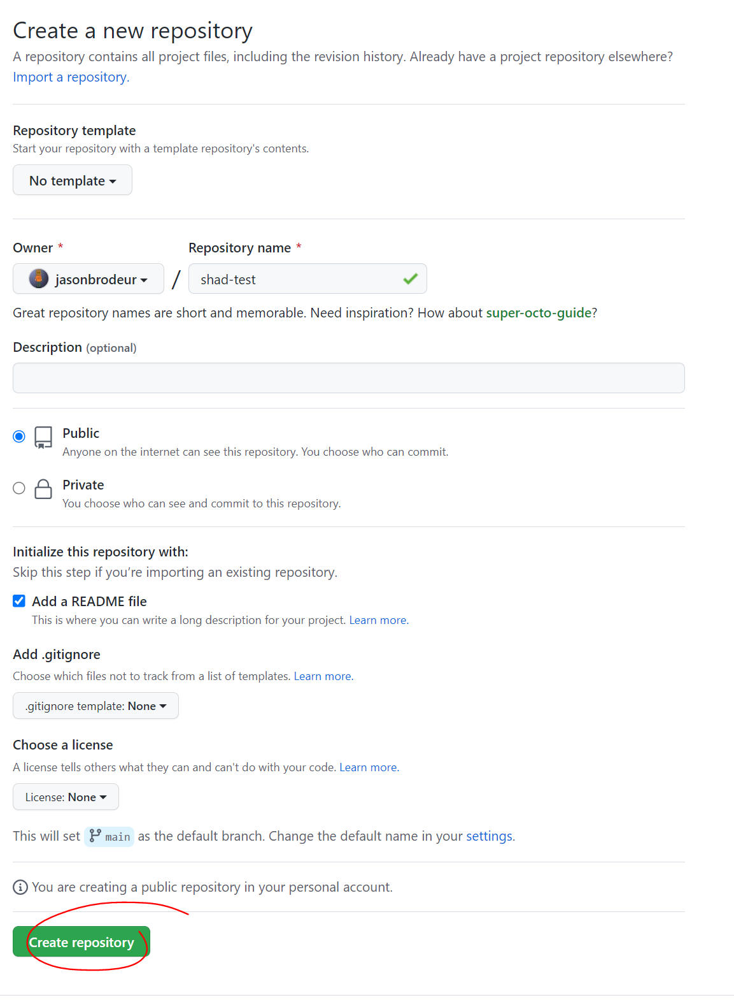

*Before starting this section, make sure you've completed all tasks in the [Preparation](preparation) page and completed [lesson 1: Intro to GIS](intro-to-GIS) and [lesson 2: Mapping our data](mapping-our-data).*

# Introduction 
In this lesson, you will learn how to create and publish a webmap using QGIS and GitHub! This process will come in handy if you ever want to share your work as interactive web maps. There are two parts of this process: 
1. Use QGIS to export your map to a webmap 
2. Use GitHub to create a website that will host your files. 

## Task 0: Get ready
- Make sure that you have your project from the [last lesson](mapping-our-data) open. 
- Also make sure you have installed the **qgis2web** plugin for QGIS. 

## Task 1: Create a webmap
- With your previous project open, click the **Create web map** button (also available from the top menu: ```Web > qgis2web > Create web map```. 
- When the **Export to web map** dialog box appears, experiment with the many settings and observe changes in the preview pane. 
	- For example, experiment with the ```Cluster``` function and the ```Popup fields``` functions. Make sure to click **Update preview** each time to see the effect of the changes. 
- In the **Export** tab, select ```Export to folder``` and point it to the working folder that contains the rest of your files. 
- At the bottom of the dialog box, select to save your map to a **Leaflet** map and click **Export**. 
- This should open up a version of the webmap in your browser. **NOTE** that this is map not publicly accessible -- it is just a file on your computer and is not published to the web. 

## Task 2: Create a GitHub Repository; Publish your webmap
- Login to [GitHub](https://github.com).
- Create a new repository. Add a readme file. Make it public. 

- Upload your webmap files to the repository
	- Click on the ```<> Code``` tab at the top of the repository.
	- Click ```Add file > Upload files```
	- Drag the contents of your leaflet folder (i.e. everything inside of /qgis2web_2022_07_23......) to the upload window. 
	- Once the files have finished loading, scroll to the bottom and click **Commit changes**.
	- You should see your files in your repository as follows:

- Turn your repository into a webpage: 
	- At the repository main page, go to the ```Settings``` tab and then open the ```Pages``` pane. 
	- Set ```Branch:main``` and use ```/ (root)```. Click "Save". 
	- Make a note of the url for your new website. 
	- Click on the new url to open it in a new window. **NOTE**: it will take a few minutes for your website to be ready--you'll need to refresh a few times. 

	
That's it!!! There is a lot more to learn about and experiment with, of course. Hopefully, these lessons give you an initial sense of the ways in which GIS software can be used to show geospatial characteristics and relationships. 